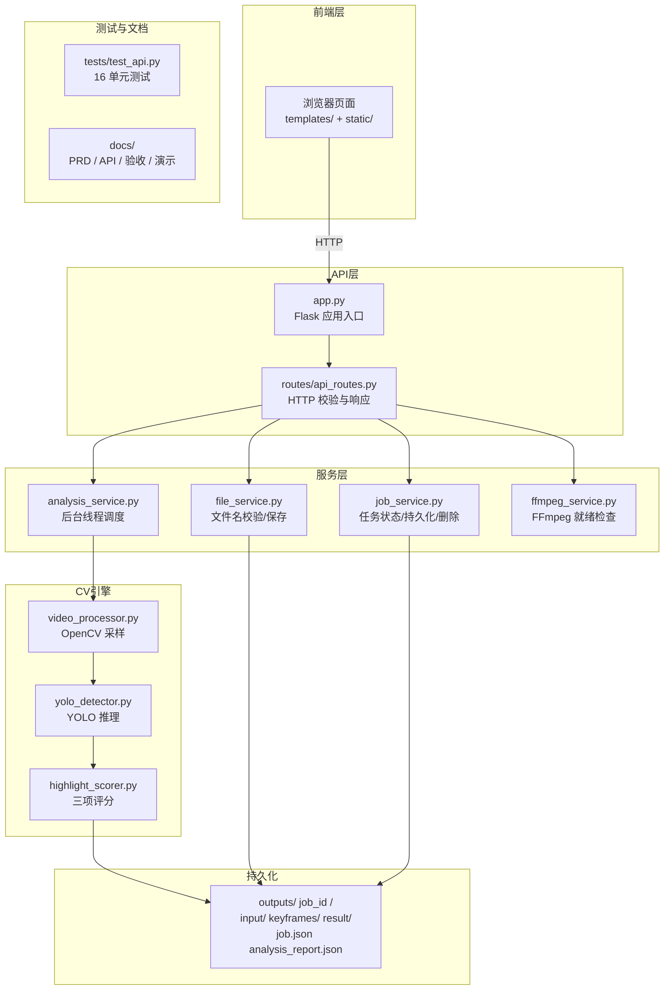

# 系统设计（第一阶段）

## 项目架构图



## 分层

```text
浏览器 / API 调用方
        |
routes/api_routes.py       HTTP 校验与响应
        |
        +-- file_service.py       文件名、扩展名、空文件和保存
        +-- job_service.py        job.json、报告、目录、状态与删除
        +-- analysis_service.py   受控后台线程 → cv_engine 桥接
        +-- ffmpeg_service.py     FFmpeg 就绪检查与粗剪接入口
        |
cv_engine/
        +-- video_processor.py    OpenCV 帧采样
        +-- yolo_detector.py      YOLO11n 推理
        +-- highlight_scorer.py   三项评分与片段推荐
        |
outputs/<job_id>/          本地文件系统持久化
```

`app.py` 只创建应用、初始化服务、注册蓝图与错误处理，并提供命令行启动参数。

## 任务持久化

任务编号严格匹配 `YYYYMMDD_HHMMSS_8位小写十六进制`。目录固定为：

```text
outputs/<job_id>/
├─ input/<安全文件名>
├─ keyframes/
├─ result/
└─ job.json
```

真实算法完成后才增加 `analysis_report.json`；真实粗剪完成后才在 `result/` 增加视频。写 JSON 时在同目录创建唯一临时文件，完成 `flush + fsync` 后使用 `os.replace` 原子替换。进程内还使用可重入锁，避免多个后台/请求线程交错写入。

## 状态与后台线程

```text
created -> queued -> running -> completed
                           \-> failed
failed  -> queued  （允许人工重试）
```

路由线程先原子地把任务更新为 `queued`，再提交给最大 1～2 个工作线程的 `ThreadPoolExecutor`。后台只接收 job_id、`Path` 和普通字典，不接收 Flask `request`。开始执行时写 `running/started_at`；算法返回真实报告后写 `completed/completed_at/result_file`；任何算法异常均写 `failed/completed_at/error`。

`analysis_service.py` 已通过桥接模式接入 `cv_engine`（`video_processor.py` → `yolo_detector.py` → `highlight_scorer.py`），YOLO11n 模型（`models/yolo11n.pt`，5.4MB）完成真实推理，输出包含目标检测、三项评分、关键帧和候选片段的完整 `analysis_report.json`。

## 重启恢复策略

本地线程不能跨进程恢复。应用启动时扫描合法任务目录，把遗留的 `queued` 或 `running` 任务标记为 `failed`，错误写为“服务重启导致后台分析任务中断，请重新发起分析”。绝不假装任务已完成。第一版不使用数据库、Redis、Celery 或跨进程队列。

## 安全边界

- job_id 同时通过正则和 `Path.resolve()` 的直接父目录检查；
- 上传扩展名在保存前校验，保存名来自 `secure_filename`；
- 删除只允许 `outputs` 的直接合法子目录，并拒绝忙碌任务；
- API 不返回系统绝对路径或 Python 堆栈；
- 损坏的任务 JSON 在列表中被跳过，详情/报告返回可读 JSON 错误；
- 模型就绪和 FFmpeg 就绪均实时检查，不写死为 `true`。

## 当前状态与后续接入口

- CV：✅ 已接入 — `analysis_service.analyze_video` 桥接 `cv_engine`，返回完整 JSON 报告；
- FFmpeg：⚠️ 未安装 — `ffmpeg_service.create_rough_cut` 仅做就绪检查，粗剪返回 501；
- 前端：✅ 基本可用 — 轮询任务详情、关键帧展示、审核写回，粗剪触发待 FFmpeg 就绪后联调。
